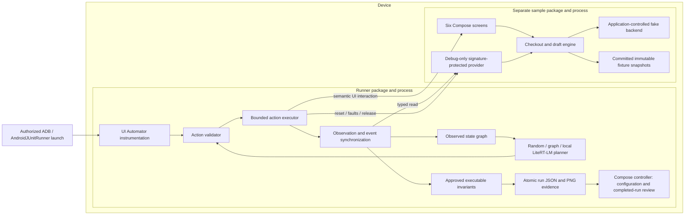
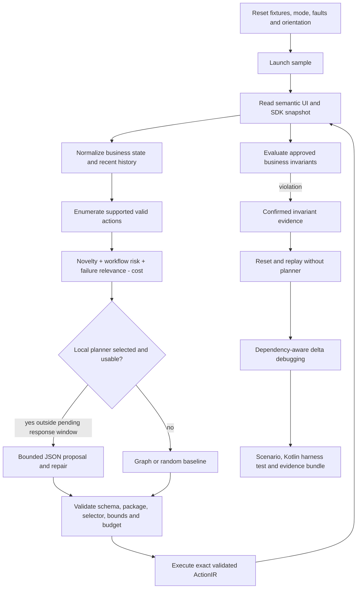
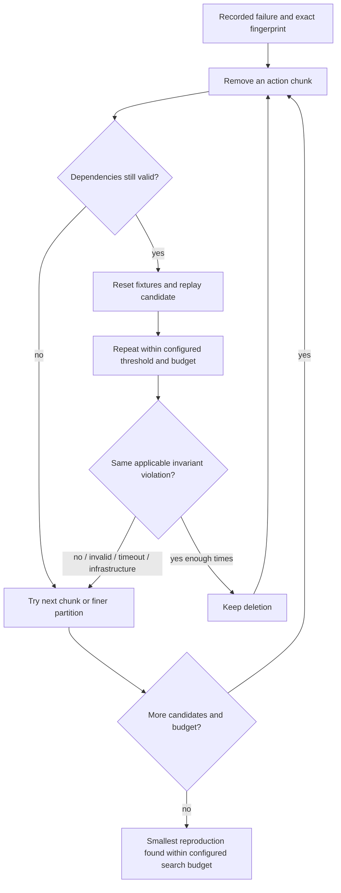

# DroidProbe architecture

DroidProbe currently supports its instrumented sample package, `dev.droidprobe.sample`. Arbitrary APK support is future work. This is a graph of observed behavior, not complete application coverage.

The installed controller has no cross-app automation privilege. An authorized test launch starts instrumentation targeting the runner itself. The target activity and provider run in the sample process; target force-stop/recreation cannot remove the runner's graph or reports. The controller stays out of the foreground during exploration. `DroidProbe` logcat entries report structured progress; completed results reside in runner private storage and can be shared with a FileProvider.

The development APKs use the same default Android debug key. The provider lives in `src/debug`, and the SDK is a `debugImplementation` of the sample. Every `ContentProvider.call` checks the signature permission and calling UID's signature explicitly. Read/reset/fault requests include a protocol version and run ID; stale run IDs are rejected. Mutations are marshalled to the sample's main thread, committed as a single SharedPreferences JSON snapshot, and then published to Compose. This small MVP uses atomic JSON files rather than Room: reports are bounded and easy to inspect/export. A migration to Room can preserve the protocol.

Observations distinguish idle, submitted, persisted/acknowledgement pending and completed states even when the UI tree is identical. Run IDs, screenshot paths, event timestamps and record IDs are excluded from signatures; business phase, order multiplicity, saved content, cart, fault state, recent event types and action history remain. Selector resource keys come from Compose `testTagsAsResourceId`, validated through UI Automator. Missing actionable accessibility information produces a recorded limitation.

Each executed action retains its exact parameters, preconditions, event dependencies, timeout, before/after observation sequences and new app events. Response delay is a deterministic acknowledgement gate, not a global network switch. Rotation awaits a new activity generation; background awaits `onPause`; typed business waits poll structured conditions with bounded deadlines. Force-stop is fixture-reset plumbing and is never described as OS process death. Supported system interactions are home, back, orientation and authorized package launch. The model cannot emit executable shell commands; the only shell command in the driver is the literal allowlisted fixture force-stop.

The sample's faulty activity recreation re-submits an accepted logical checkout while its acknowledgement is held; the faulty backend inserts another record. Corrected activity handling retains the pending operation, and backend persistence is idempotent by logical operation ID. The draft defect loses acknowledged content on recreation; corrected restoration uses the committed content. Identical executable assertions run against both modes.

Replay outcomes are reproduced, failure not observed, invalid precondition, infrastructure failure and timeout. The regression harness passes only if the same applicable assertion executes and passes. Minimization never counts an invalid replay as preserving a failure, and records raw successes/attempts. Failure fingerprints include the invariant and expected business result, preventing unrelated predicates on the same screen from merging.

The local adapter calls the actual pinned LiteRT-LM Engine/Conversation API on a background dispatcher. It uses CPU, verifies artifact SHA-256, records model identity/configuration, and registers no executable tools. A small quantized `.litertlm` model must be benchmarked on the intended ARM64 physical device. Missing/incompatible models remain explicitly labeled graph baselines. Model latency/parse failures/fallbacks are stored; no cloud inference is implemented.

Crash diagnosis and generalized responsiveness oracles require additional supported evidence collection. Current lifecycle/business failures are confirmed by SDK predicates; runner exceptions remain infrastructure failures and workflow deadline breaches remain suspected stalls. No LLM screen opinion becomes a confirmed finding.
