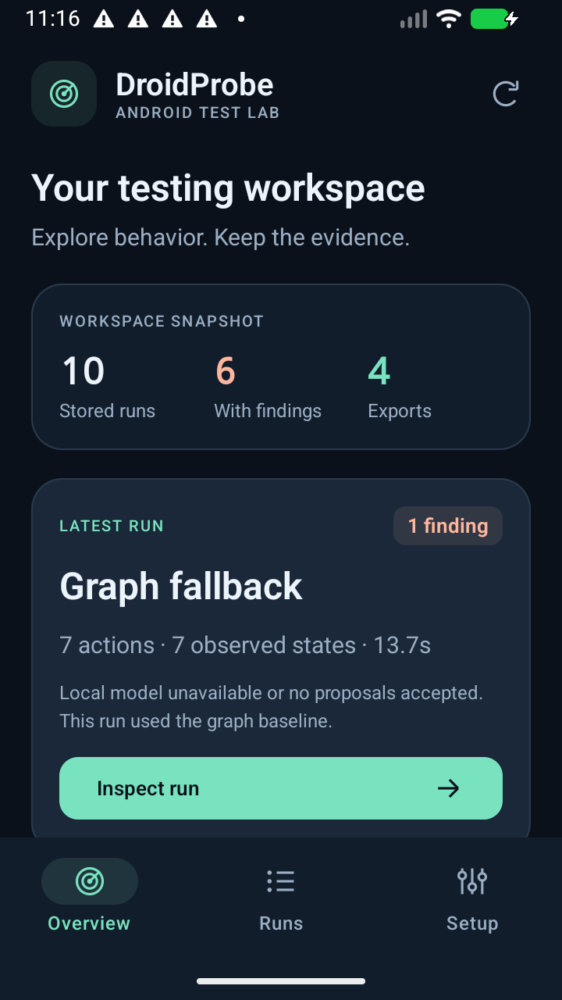
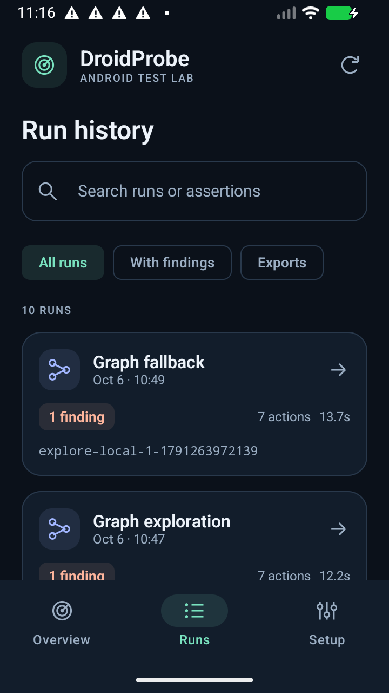
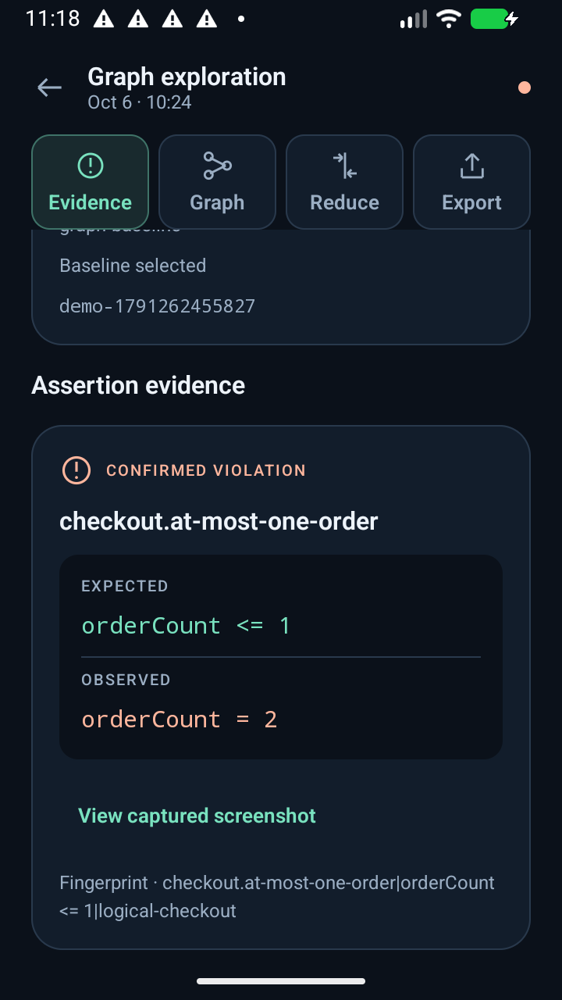
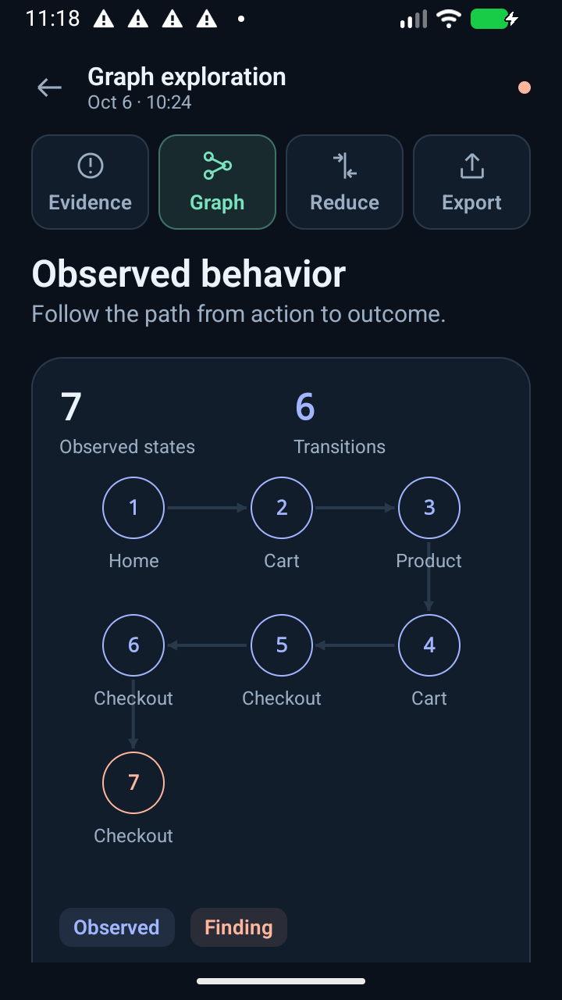
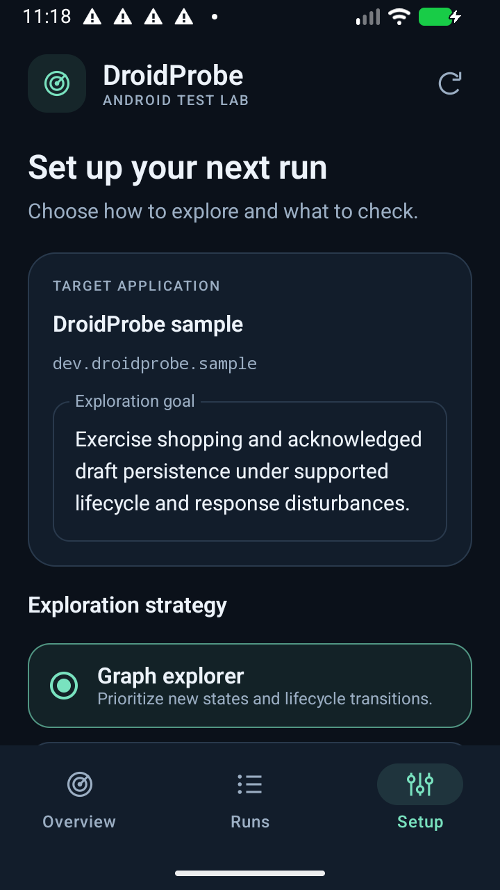
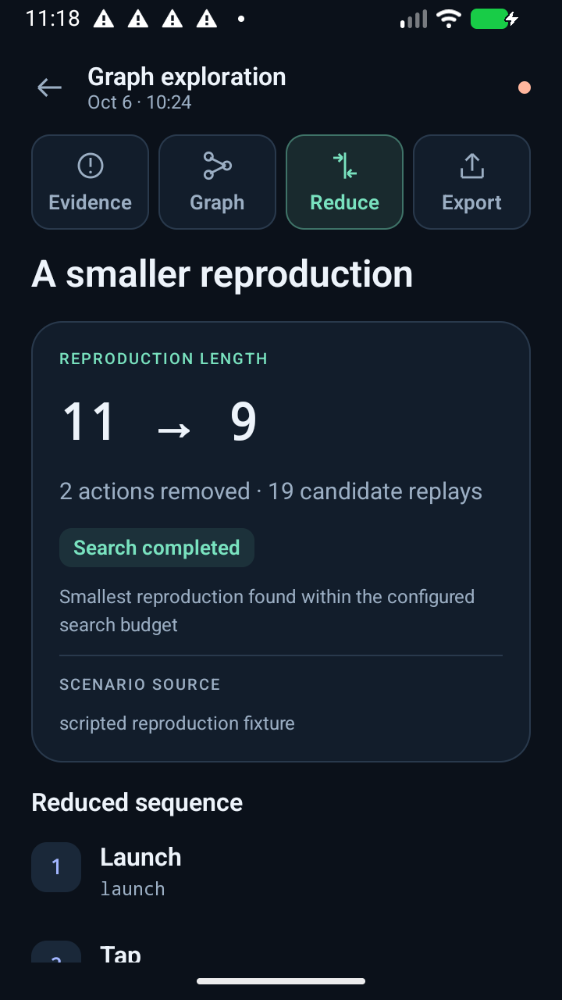
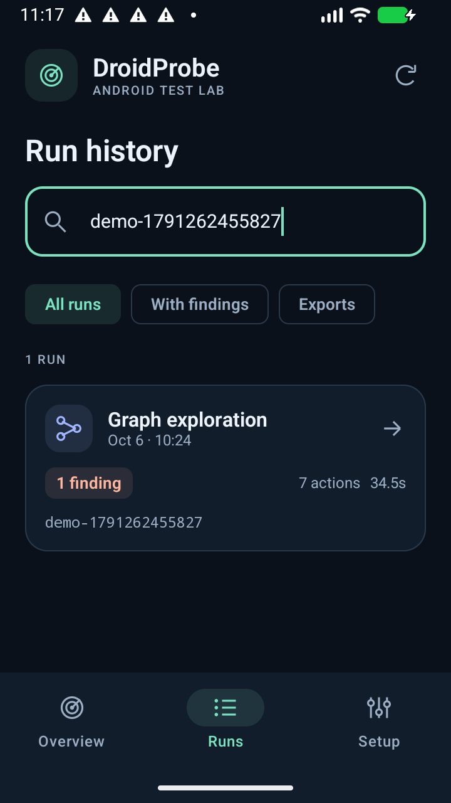
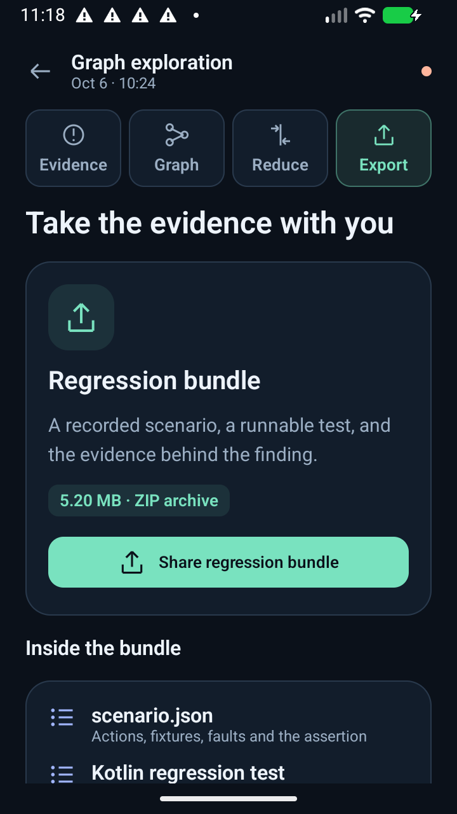

# Controller UI

The controller uses native Kotlin, Jetpack Compose and Material 3. The refresh adds a shared navy/mint palette, compact typography, bordered panels, custom vector icons and a matching adaptive launcher icon. It uses the existing dependencies.

## Navigation

- **Overview**: stored-run totals, runs with findings, available exports and the latest run. All counts come from actual reports.
- **Runs**: search by run ID, planner, status or assertion; filter for findings and exported bundles. Cards show readable planner names, dates, actual total actions and elapsed exploration time.
- **Setup**: goal, planner choices, action budget, sample mode, approved business assertions, model status and a copyable ADB launch command.
- **Run details**: Evidence, Graph, Reduce and Export are visible together. Each view starts with its own scroll position. Android Back returns to the workspace.

Evidence distinguishes expected and observed values, exposes replay outcomes and keeps screenshots and long diagnostics expandable. The graph has numbered, labeled, selectable states, highlights failures and provides a complete state/transition directory below its bounded visualization. Reduction exposes candidate outcomes and the source of the scenario being reduced. Export shares the existing ZIP through Android's share sheet.

Report loading and screenshot decoding run off the UI thread. Run cards count actions across all episodes; the evidence timeline explicitly identifies the final episode when earlier episodes exist. Missing-model runs retain their graph-fallback label.

## Screenshots

These are unedited captures from the installed controller using existing device reports.

| Overview | Runs |
|---|---|
|  |  |

| Evidence | Graph |
|---|---|
|  |  |

| Setup | Reduction |
|---|---|
|  |  |

| Search | Export |
|---|---|
|  |  |

## Validation scope

UI build and emulator review are recorded separately from the earlier business-workflow validation in [Validation.md](Validation.md). The original workflow logs and APK hashes in `docs/evidence` remain historical evidence from that execution. This refresh changes the controller presentation and navigation.

On 2026-10-06, the runner debug build passed after the redesign and again after fixing a clipped detail-navigation tab found during visual review. The final APK was installed on the existing 720 × 1280 emulator. Review covered all screens, finding/export filters (six and four matching runs), search for a specific demo (one result), opening that result, all four detail tabs fitting onscreen, graph state selection, the recorded 11-to-9 reduction, export availability and returning through the bottom navigation. Captures above are from that final APK. The installed and local APK SHA-256 matched:

`1eff0d857aba217d4189ca2988c153f8953d341cdd58c210f4390c16634c32c8`
